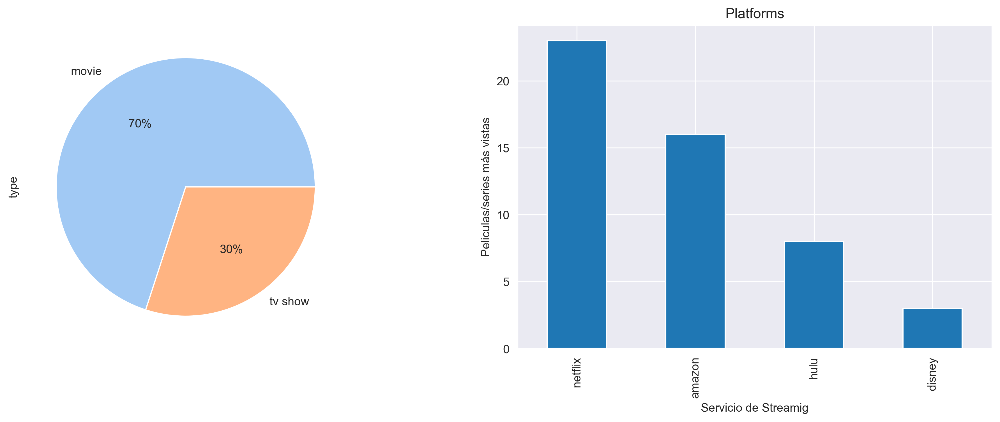

# <h1> Pj_05-001 Desarrollo de un Modelo de Machine Learning para la recomendación de peliculas en plataformas de streaming</h1> 
## **HENRY BOOTCAMP | Proyecto Individual Nº1** **`Machine Learning Operations (MLOps)`**

*El presente proyecto se desarrolla para dar cumplimiento a las actividades planteadas en la etapa de labs en el Bootcamp de Data Science de [Soy Henry](https://www.soyhenry.com/). Pretende abarcar todo el ciclo de vida de un proyecto de Machine Learning  desde el tratamiento y recolección de los datos (Data Engineer stuff) hasta el entrenamiento y mantenimiento del modelo de ML.* 

## 1. Introducción

Se realiza la ingesta y análisis a datos informativos de series y películas de las plataformas (Amazon, Disney, Hulu, Netflix) para llevar a cabo un **`MVP`** (_Minimum Viable Product_) de un sistema que por medio de Ciencia de Datos y Machine Learning  permita generar recomendaciones en las aplicaciones de estas plataformas de streaming a  usuarios activos que realizaron reseñas a peliculas o series que hayan visto.  

Se cuenta con doce (12) datasets. Los cuales contienen las películas/series de cada plataforma de streaming e información de las calificaciones de películas generadas por los usuarios de estas aplicaciones. Se aplican las transformaciones pertinentes a los datasets para disponibilizar los datos limpios y generar consultas a través de una API construida en un entorno virtual dockerizado. 

Se implementa un modelo de machine learnig ML no supervisado. Usando la tecnica: descomposición singular de valores (SVD) se analiza y predice las preferencias de peliculas y series del usuario dada sus calificaciones históricas en las plataformas de streaming.

## 2. Desarrollo

Los requerimientos que plantea [Soy Henry](https://www.soyhenry.com/) son: 

**2.1. ETL Limpieza de datos:**

* *Generar campo id: Cada id se compondrá de la primera letra del nombre de la plataforma, seguido del show_id ya presente en los datasets (ejemplo para títulos de Amazon = as123)*

* *Los valores nulos del campo rating deberán reemplazarse por el string “G” (corresponde al maturity rating: “general for all audiences”)*

* *Las fechas, deberán tener el formato AAAA-mm-dd*

* *Los campos de texto deberán estar en minúsculas, sin excepciones*

* *El campo duration debe convertirse en dos campos: duration_int y duration_type. El primero será un integer y el segundo un string indicando la unidad de medición de duración: min (minutos) o season (temporadas).*

**2.2. Desarrollo API:**  disponibilizar los datos para realizar las siguientes consultas:

* *Película con mayor duración con filtros opcionales de AÑO, PLATAFORMA Y TIPO DE DURACIÓN. (la función debe llamarse get_max_duration(year, platform, duration_type))*

* *Cantidad de películas por plataforma con un puntaje mayor a XX en determinado año (la función debe llamarse get_score_count(platform, scored, year))*

* *Cantidad de películas por plataforma con filtro de PLATAFORMA. (La función debe llamarse get_count_platform(platform))*

* *Actor que más se repite según plataforma y año. (La función debe llamarse get_actor(platform, year))*

**2.3. Deployment**

**2.4. EDA**

**2.5. Sistema de recomendación ML**

## 3. Recursos implementados

Python Version: 3.9 
Packages: Uvicorn, Pandas, Matplotlib, Seaborn, Surprise, Gradio. 
Render. 
Framework FastAPI. 

### 2.1. ETL Limpieza de datos

El proceso de ETL se realiza con estos datos de origen: [**data**](https://drive.google.com/drive/folders/1_aDmVMpuOBCjlyEr86vpNFoYGloQ0bB9?usp=sharing) y se implementa la librería de pandas para las trasformaciones necesarias. 

- Se cargan los datos para su normalización. 

- Se relaciona el conjunto de datos. 

- Se realiza los requerimientos [Soy Henry](https://www.soyhenry.com/). 

- Se crean dos datasets para realizar consultas: ( [**df.csv** ](https://github.com/jospinoponce/ModeloRecomiendaPeliculas/blob/main/Datasets/df.csv) tiene los datos de todas las peliculas y series. ) & ([**df_1.parquet** ](https://github.com/jospinoponce/ModeloRecomiendaPeliculas/blob/main/Datasets/df_1.parquet): almacena calificaciones realizadas por usuarios en las plataformas). 

*Los procesos realizados para el ETL están en el notebook:* [**1.ETL**](https://github.com/jospinoponce/ModeloRecomiendaPeliculas/blob/main/Notebooks/1.ETL_report.ipynb)

### 2.2. Desarrollo API

Se utiliza el Framework FastAPI basado en python. 

- Se generan las consultas solicitadas. 

*Los procesos realizados están en el .py:* [**main.py**](https://github.com/jospinoponce/ModeloRecomiendaPeliculas/blob/main/main.py)

### 2.3. Deployment

Se implementa la nube del web service gratuito que proporciona [Render.com](https://render.com/) para realizar el deploy y correr en su entorno la app.  

*Las consultas a la API, URL:* [**API_RENDER**](https://consultas-api-peliculas-3.onrender.com) 
 

### 2.4. Análisis Exploratorio de datos EDA

Se usan las librerias de Matplotlib y Seaborn para el desarrollo de gráficas que permitan analizar la distribución de los datos previamente transformados. 

Se determina que:

*115077 usuarios realizaron 11005757  calificaciones a películas/series en las distintas plataformas streaming con un score de 1 a 5.*

| score |    %    |
|:-----:|:-------:|
|   1  |  4.67 % |
|   2  |  8.24 % |
|   3  | 25.07 % |
|   4  | 39.01 % |
|   5  | 23.02 % |

*Los usuarios ven en las plataformas de streaming más películas que series.* 
*La plataforma de streaming que más visualizaciones tiene es netflix.* 
*Las dos películas más vistas con más de 560 reseñas son de amazon "from other worlds" y "the organization".* 
*El género de peliculas o series que más visualizaciones tiene es "comedia".*

*Los procesos realizados para el EDA están en el notebook:* [**2.EDA**](https://github.com/jospinoponce/ModeloRecomiendaPeliculas/blob/main/Notebooks/2.EDA_report.ipynb)

### 2.5. Sistema de recomendación ML

EL sistema de recomendación que se desarrolla define si para un id usuario seleccionado una película determinada sería recomendable o no.  

El modelo establece una recomendación positiva a una calificacion predicha superior al 3,7 de rating en un score del 1 al 5.

Se usa la librería Suprise, Gradio. 

- Se instancia y se entrena un modelo SVD (Descomposición Singular de Valores). 
- Se genera el modelo de recomendación.
- Se calcula el error cuadrático medio (RMSE) y el error absoluto medio (MAE) al modelo. 
- Se validan hiperparámetros.
- Se desarrolla una interfax para el MVP del sistema de recomendación a través de Gradio.

*Los procesos realizados para el Modelado de Machine Learning están en el notebook:* [**3.ML_model**](https://github.com/jospinoponce/ModeloRecomiendaPeliculas/blob/main/Notebooks/3.ML_model.ipynb)

Se puede acceder a la consulta de la interfaz a traves de este link: [**MVP_MODELO**](https://73cc22ab0b93164c6a.gradio.live/) (*Solo estará acccesible durante 72h a partir del ultimo update de este repositorio*) 

## 5. Conclución

Se concluye que como un **`MVP`** (_Minimum Viable Product_) el modelo es aceptable. Tiene un MAE de 0.75 indicando que, en promedio, el modelo comete un error absoluto medio del  75% en las predicciones de calificaciones de películas para un usuario, esto significa que es capaz de hacer predicciones precisas. El valor de RMSE es de 0.96 es relativamente alto, el modelo tiene una gran variabilidad en las predicciones.

Para modelos de recomendación de películas,  es importante tener en cuenta otros aspectos, como la diversidad y serendipia de las recomendaciones, la cobertura de las recomendaciones, la escalabilidad,  la capacidad de explicar las recomendaciones. Variables que no se tienen en cuenta para el desarrollo de este proyecto.

